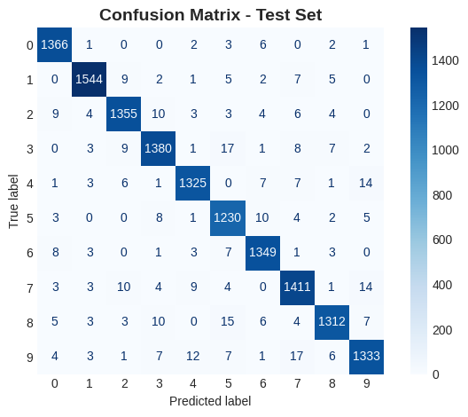

# MNIST MLP Classifier (scikit-learn)

A clean and reproducible pipeline for handwritten digit classification on the MNIST dataset using an MLP neural network implemented with [scikit-learn](https://scikit-learn.org/).  
Includes preprocessing, training with early stopping, evaluation, confusion matrix visualization, and probability analysis.

---

## Features

- Load and preprocess the MNIST dataset
- Feature scaling with `StandardScaler` (train-only fit to prevent leakage)
- Training with `MLPClassifier` (early stopping enabled)
- Evaluation: accuracy, classification report, confusion matrix (raw & normalized)
- Visualize correct & misclassified samples
- Probability distribution for single sample predictions
- Clean code structure & reproducible results

---

## Installation

1. Clone the repository:

   ```bash
   git clone https://github.com/<AmirMohammadRezaie>/sklearn-mnist-mlp.git
   cd sklearn-mnist-mlp
   ```

2. Create a virtual environment (optional but recommended):

   ```bash
   python -m venv .venv
   source .venv/bin/activate   # On Windows: .venv\Scripts\activate
   ```

3. Install dependencies:
   ```bash
   pip install -r requirements.txt
   ```

---

## Usage

1. Open the notebook:

   ```bash
   jupyter notebook notebooks/mnist_mlp.ipynb
   ```

2. Run all cells sequentially:
   - Load MNIST dataset
   - Scale features (train only)
   - Train MLP model with early stopping
   - Evaluate performance
   - Visualize predictions

---

## Results

| Metric               | Train Accuracy | Test Accuracy |
| -------------------- | -------------: | ------------: |
| MLPClassifier (ReLU) |         99.59% |        97.18% |

- Confusion matrix shows strong performance across all classes.
- Small generalization gap thanks to early stopping and scaling.
- Inference with probability outputs included.

<p align="center">
  
</p>

---

## Requirements

- Python 3.9+
- numpy
- pandas
- matplotlib
- seaborn
- scikit-learn
- joblib _(optional for saving models)_

---

## License

This project is licensed under the [MIT License](./LICENSE).  
Feel free to use, modify, and distribute with attribution.

---

## Acknowledgements

- [MNIST dataset](http://yann.lecun.com/exdb/mnist/)
- [scikit-learn](https://scikit-learn.org/stable/) for MLP implementation
- Inspired by classic machine learning examples.

---

## Contributing

Contributions and suggestions are welcome!  
If you'd like to add improvements (e.g., hyperparameter tuning, model comparison, or visualization enhancements):

1. Fork the repo
2. Create a new branch
3. Submit a pull request

---

## Contact

**Author:** AmirMohammadRezaie  
**GitHub:** [@AmirMohammadRezaie](https://github.com/AmirMohammadRezaie)

---
